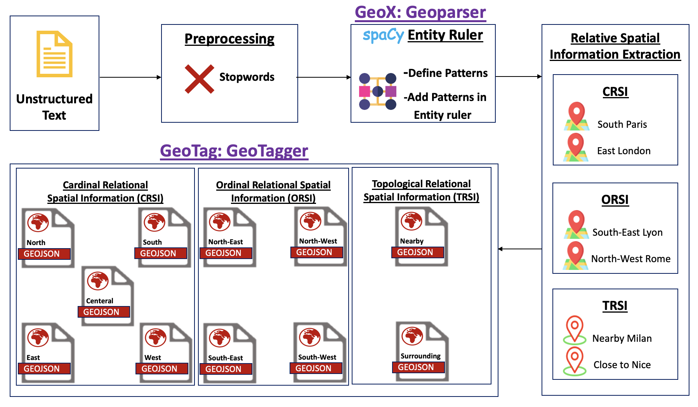
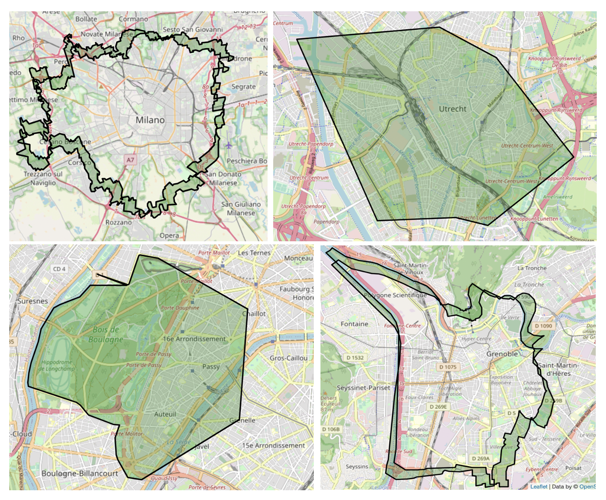

# GeoTag - Identification of Geographical Information of Relative Spatial Information (RSI)


## GeoTag

Geotag is a Python command-line application to identify the geographical coordinates of relative spatial information (RSI). In this work, we identified the following spatial relations (**north**, **south**, **east**, **west**, **north-east**, **north-west**, **south-east**, **south-west**, **central**, **nearby**, **surrounding**) of location. 


## Process Pipeline



## Configuration
Change the **line # 11** and **line # 12** in the code for which you want to identify the spatial relations

**Default**
```python
locale = "IT"
city = "Milan"
```

E.g. to identify the spatial relations of city **Nice** in **France**, You can change it accordingly using following code in **line # 11** and **line # 12**.

```python
locale = "FR"
city = "Nice"
```

## Installation

To run the Python console application to identify the coordinates of configured location in previous step. Follow the below step

```
python GeojsonUtil.py
```

## Output 

- The output after running **GeoTag** will be saved in directory e.g. for city **Nice** located in **France**, the output directory is  '/geojson/fr/cities/nice/'.
- In each location directory, there are 11 geojson files which contains geographical coordinates i.e. **north.geojson**, **south.geojson**, **east.geojson**, **west.geojson**, **north-east.geojson**, **north-west.geojson**, **south-east.geojson**, **south-west.geojson**, **centeral.geojson**, **nearby.geojson**, **surrounding.geojson**.   


## GeoTag - Visualizer

**GeoTag - Visualizer** is a web application built in python language used for visualizing the above relative spatial information (RSI).

## Live Demo Application

[Live Demo](https://share.streamlit.io/anonymous-agile/rsi_tagger/main/App.py)

## Instllation 

There are few Python packages that are needed to install for running the GeoTag demo application

1. Install streamit library for running GeoTag web application

```sh
pip install streamlit
```

2.  Install folium library for manipulating your data in Python, then visualize it in a Leaflet map via folium.

```sh
pip install folium
```
3. Install streamlit-folium library to visualize Leaflet map in streamlit web application

```sh
pip install streamlit-folium
```


## Examples

Few examples of RSI captured from GeoTag Visualizer i.e. *nearby Milan*, *central Utrecht*, *south Paris* and *surrounding of Grenoble*


